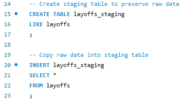
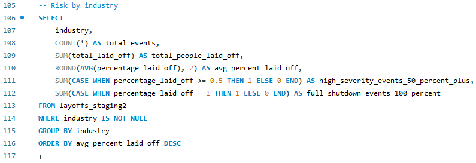
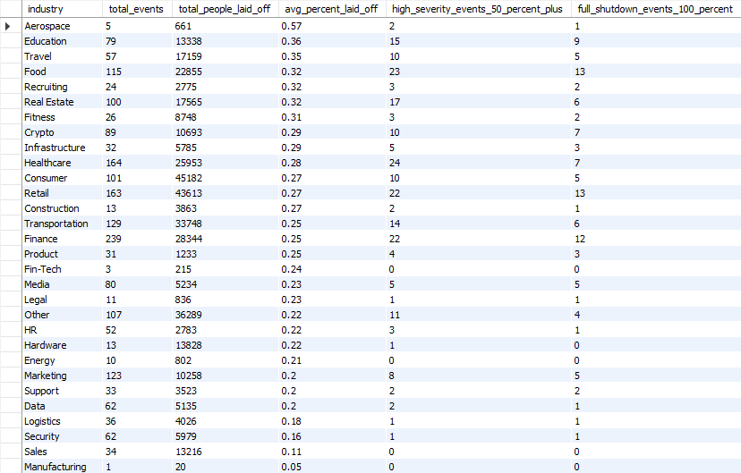
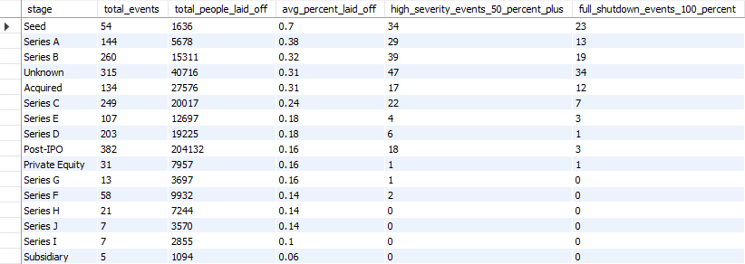
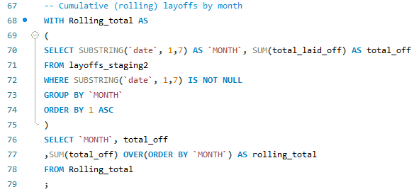
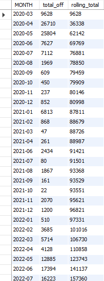

# Global Layoff Risk Analysis (SQL)

## Overview

This project analyzes global layoff data to evaluate **workforce risk across industries and company stages**.

Rather than focusing solely on total layoffs, this analysis reframes the dataset around a strategic business question:

> **Which industries and stages show the highest layoff risk, and what actions can leaders or investors take to reduce the likelihood of catastrophic layoffs (50–100%)?**

The objective is to move beyond descriptive analytics and develop a structured, risk-oriented perspective that supports executive decision-making.

---

## Business Problem

While total layoff counts offer a broad snapshot, they do not fully capture organizational risk. Workforce risk should be evaluated across three dimensions:

1. **Frequency** – How often layoffs occur  
2. **Severity** – The average percentage of workforce reduced  
3. **Catastrophic Events** – Workforce reductions of 50% or greater, including full shutdowns (100%)

This project builds SQL queries to quantify each of these dimensions across industries and company stages.

---

## Tools & Techniques Used

- SQL (MySQL syntax)
- Data cleaning with staging tables
- Window functions (`ROW_NUMBER`, `DENSE_RANK`)
- Common Table Expressions
- Conditional aggregation (`CASE WHEN`)
- Rolling totals for time-based trend analysis
- Data standardization and NULL handling

---

## Data Preparation

To ensure analytical accuracy, the dataset was cleaned prior to analysis.

Key preparation steps included:

- Creating staging tables to preserve the raw data 
- Removing duplicates using `ROW_NUMBER()`
- Standardizing inconsistent text values (company, industry, country)
- Converting date fields to proper `DATE` format
- Replacing blank values with `NULL`
- Backfilling missing industry values using self-joins
- Removing rows lacking layoff metrics

These steps ensured the final analysis was performed on structured, reliable data.

### Data Cleaning Evidence 

#### 1. Creating a Staging Table (Preserving Raw Data)

#### 2. Identifying Duplicates Using ROW_NUMBER()

---

## Risk Analysis Framework

Layoff risk was evaluated using aggregated metrics grouped by:

- **Industry**
- **Stage**

For each group, the following were calculated:

- Total layoff events  
- Total employees laid off  
- Average percentage laid off  
- Number of high-severity events (>= 50%)  
- Number of full shutdown events (100%)

### Risk by Industry (Frequency + Severity + Catastrophic Events)

The following query aggregates layoff risk metrics by industry, incorporating frequency, severity, and catastrophic workforce reductions.

### Risk by Stage (Frequency + Severity + Catastrophic Events)

This query applies the same risk framework across funding stages to evaluate whether company maturity reduces layoff risk.

This approach gives more context than just looking at total layoffs alone.

---

## Key Findings

- Layoffs were not evenly distributed over time. Clear spike periods occurred around the COVID-19 pandemic and the years that followed, reflecting the immediate economic shock of 2020 and continued workforce reductions in subsequent years. Many of these total workforce reductions were driven by large publicly traded companies in the Consumer and Retail sectors such as Amazon, Google, and Meta.

### Layoffs Over Time (Monthly + Rolling Total)

The following query aggregates layoffs by month and calculates a rolling cumulative total to identify acceleration periods.

  
- While layoffs occurred across all industries, Education (36%) and Travel (35%) recorded the highest average percentage workforce reductions, followed by Food, Recruiting, and Real Estate (32%). This indicates that certain industries respond to economic shifts with more severe proportional cuts, suggesting higher workforce volatility in these sectors.

### Industry Frequency vs. Average Severity

To avoid overemphasizing industries with only a few extreme cases, the following query filters for industries with at least 5 layoff events and compares frequency against average percentage reductions.

  
- While layoffs occurred across all funding stages, post-IPO companies accounted for the largest total workforce reductions. This suggests that company maturity and access to capital do not insulate firms from macroeconomic pressures. Instead, larger public companies may face greater pressure to optimize costs during downturns.
- There are multiple examples of 100% layoffs across different stages, reinforcing that operational discipline matters more than funding.
- The majority of total layoffs originated from U.S.-based companies, which aligns with the dataset’s high representation of large, publicly traded firms headquartered in the United States.

---

## Strategic Recommendations

### 1. Monitor High-Risk Industries

Industries with average layoff percentages above the dataset median of 25% should:

- Avoid hiring too quickly during strong growth periods  
- Maintain longer cash reserves to reduce the likelihood of emergency layoffs during downturns
- Plan for different growth scenarios instead of assuming best-case outcomes 

---

### 2. Flag Catastrophic Workforce Reductions

Layoffs of 50% or greater should be tracked as a distinct risk category.

Organizations and investors should:

- Avoid overspending  
- Make sure hiring decisions still make sense if growth slows  
- Prioritize sustainable scaling over aggressive expansion  

---

### 3. Do Not Rely on the Stage as a Safety Signal

Risk is present across all stages.

Decision-makers should focus on:

- Operational efficiency  
- Avoid hiring faster than growth can support  
- Capital allocation strategy  

---

### 4. Use Time Trends as Early Warning Indicators

Rolling monthly totals highlight acceleration periods in workforce reductions.

Organizations can use similar tracking mechanisms internally to:

- Hold off on hiring if the industry shows signs of slowing  
- Update growth plans based on current trends 
- Shift spending priorities when needed

---

## Limitations

- Dataset reflects publicly reported layoffs and may underrepresent smaller private companies
- Layoff percentage does not capture company profitability, cash position or company size
- Geographic trends may reflect the concentration of companies within the dataset rather than true global layoff distribution.

---

## What This Project Demonstrates

- End-to-end data cleaning and transformation in SQL  
- A basic understanding of window functions and CTEs  
- Risk-based analytical thinking  
- Ability to translate quantitative findings into strategic recommendations  

This project reflects both technical SQL capability and business-oriented analytical reasoning.

---

## Project Background

The initial structure of this project was inspired by Alex The Analyst’s SQL World Layoffs tutorial.

The analysis was expanded beyond the guided framework by developing additional risk-based metrics, reframing the analysis around layoff frequency and severity, and incorporating strategic business recommendations which were not included in the original tutorial.

## SQL Files

The full SQL scripts used in this project are available below:

- [Part 1 – Data Cleaning](sql/part1_data_cleaning.sql)
- [Part 2 – Analysis & Risk Framework](sql/part2_analysis.sql)
